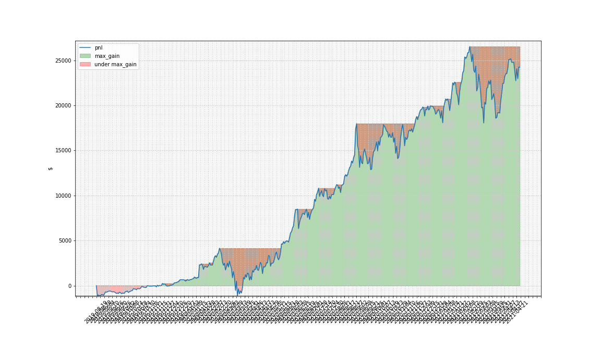

# portfolio_tracking

this is a simple class to track your investments value through a Telegram Bot using yahoo_finance api (its slow but fun)..

you can use the following formats (somewhat loosly) in order to - 

'plot equity' / 'plot pnl' / plot pnl/equity days NUM_OF_DAYS : this will plot equity/pnl values over the number of days (default all).
'get status' : this will update current price for each symbol in your portfolio and calculate equity, pnl, etc.
'status with price' : same as above but will also printout current price for each symbol in your portfolio.
'get price for symbol/s AAPL NVDA btc-usd : will show current price for each of the symbols written.
'open position broker BROKER_NAME symbol ANY_SYMBOL price YOUR_PURCHASE_PRICE quantity NUMBER_OF_SHARES_BOUGHT' : this will add this position to your portfolio and will track it from now on.

TODO: add sell/close position at price and update equity/pnl accordingly.

